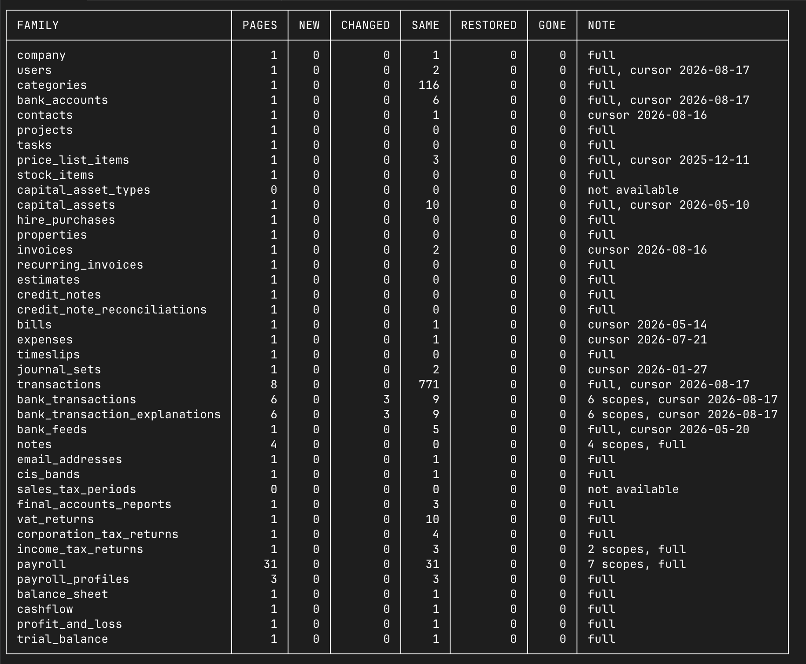

# freeagent-sync

`fasync` mirrors a FreeAgent company into a local SQLite archive, with its
attachments, and keeps that copy current.

It exists for the case where somebody else administers the books. Your
accountant drives the live account; this is the reader that makes the data
yours: bank transactions, invoices, bills, expenses, the scanned receipts
attached to them, and the ledger behind them.

Built on [github.com/alekc/freeagent](https://github.com/alekc/freeagent).

> **Status: reading is done.** Every resource family the FreeAgent API exposes
> is archived, verified, queryable and exportable. What remains is the write
> path, which is deferred by design. See [docs/design.md](docs/design.md).



One row per family, whatever it took to read it. `full` means the family was
read whole rather than filtered, `cursor` is how far the incremental position
moved, `6 scopes` is a family the API insists on reading one bank account at a
time, and `not available` is a feature this company does not have. The counts
separate new records from changed, unchanged, restored and gone, because a sync
that reports one number cannot tell you it did nothing.

## Why

- **You own the copy.** A plain `.sqlite` file plus a directory of files. No
  server, no daemon, no vendor.
- **Nothing is dropped.** Every response is archived verbatim, so a field this
  tool does not model yet is still recoverable later, without going back to
  someone else's production accounting account.
- **Deletions are noticed.** FreeAgent has no deletions feed, so a periodic
  full-key sweep finds them. Records are soft deleted and never removed.
- **It cannot write.** The read path builds its client with the SDK's
  `WithReadOnly()`, and there is no code path that constructs a writable one.

## Install

```bash
go install github.com/alekc/freeagent-sync/cmd/fasync@latest
```

Or take an archive from the [releases](https://github.com/alekc/freeagent-sync/releases).
Binaries are published for Linux, macOS and Windows on amd64 and arm64. The
SQLite driver is pure Go, so there is nothing to install alongside them.

Requires Go 1.26 to build.

### Container

Published for `linux/amd64` and `linux/arm64` on a distroless base, so there is
no shell in the image:

```bash
docker run --rm -v fasync-data:/data -v fasync-config:/config \
  ghcr.io/alekc/freeagent-sync:latest status
```

Two mounts, because they differ in lifetime and in sensitivity. `/data` is the
archive and is what you back up. `/config` holds the OAuth token, which
FreeAgent rotates on every refresh, so that mount has to be writable or the run
after next has nothing left to refresh with.

See [Scheduling](#scheduling) for running it from cron against a directory the
host also uses.

## Getting started

```bash
export FREEAGENT_CLIENT_ID=... FREEAGENT_CLIENT_SECRET=...

fasync init
fasync account add homeco -env sandbox -name "Home Co Ltd"
fasync auth login
fasync probe            # find out which families honour updated_since
fasync pull             # archive everything
fasync status
```

Register an application at [dev.freeagent.com](https://dev.freeagent.com/apps).
One app serves both sandbox and production; what differs is the account you
approve it with. The redirect URI defaults to `http://localhost:8723/callback`
and has to be registered on the application before login will work.

## Reading

```bash
fasync pull                            # changes since the last run
fasync pull --full                     # ignore the cursor, read everything
fasync pull --family bills,invoices
fasync pull --full --reconcile-if-due  # sweep for deletions when one is due
fasync pull --no-blobs --no-files      # archive only, skip downloads and trees
fasync reconcile                       # read everything and mark what is gone
fasync reconcile --dry-run             # report what that would remove, remove nothing
fasync families                        # what is archived and what is not
```

### Before a sweep removes anything

A sweep marks whatever the read did not see. That is only correct if the read
really did cover the family, and an endpoint that quietly narrows its own
window answers a fraction of one while still reporting a complete walk. Two
things stand between that and a mass deletion:

`--dry-run` computes each sweep and reports it without deleting. It withholds
the delete and nothing else: the read still archives, because `last_seen_at` is
what the sweep set is derived from, and attachments and the browsable trees are
still brought up to date.

`--max-sweep-fraction` refuses a sweep that would remove more than a share of a
family's live records, 10% by default. Genuine deletion upstream is a trickle,
so a bulk hit is nearly always a short read. The share is measured against what
the family held before the run, so a read answering with a different set rather
than a shorter one cannot dilute its own deletion. A refused sweep deletes no
records, names the family, and makes the run exit 1; the read that preceded it
still archived, exactly as under `--dry-run`. Pass `1` to allow a sweep of any
size, deliberately. Families with fewer than 20 live records are swept
unbounded, since a fraction of a handful says nothing.

The run table tells the two zeros apart. A family that was swept and found
nothing gone shows `0`; one that was not checked shows `-`, and the summary
line says how many families were actually swept.

A pull downloads any new attachments and regenerates the browsable trees when
it finishes, so one command leaves everything consistent.

Both time windows accept `2026-03-01`, an RFC 3339 instant, `now`, `today`, or
a relative offset (`30m`, `2h`, `3d`, `2w`, `6mo`, `1y`):

```bash
fasync pull --from 2026-01-01 --to 2026-03-31   # by business date
fasync pull --changed-since 2w                  # by modification time
```

`m` is minutes and `mo` is months. Months and years are calendar-aware, so
`1y` from 29 February lands on 28 February, not 1 March.

**An explicit window makes the run ad-hoc, and an ad-hoc run never advances
the stored cursor.** Otherwise a narrow manual pull would leave the next
scheduled run believing it was caught up.

## Querying

Views over the main families, so the common questions need no JSON at all:

```bash
fasync sql "select id, reference, dated_on, total_value from v_invoices
            where status = 'Open' order by dated_on"

fasync sql "select * from v_files where family = 'bills'"
fasync sql "select family, count(*) from records group by family"
```

`v_invoices`, `v_bills`, `v_expenses`, `v_bank_transactions`, `v_transactions`,
`v_contacts` and `v_files`. Anything they do not cover is reachable with
`json_extract`, because the archive keeps every response body:

```bash
fasync sql "select json_extract(body, '\$.payment_terms_in_days')
            from records where family = 'invoices'"
```

Read-only: write verbs are refused before the query reaches SQLite. Or just
open `freeagent.sqlite` with any tool you like.

## What your company may not have

Some families depend on the company type, the plan or your role, and the API
answers 403 or 404 for them. Those are reported as **not available** rather than
as failures, because a limited company genuinely has no self assessment returns
and reporting that as broken on every run would be noise.

`fasync probe` also tells you which families honour `updated_since`. The ones
that ignore it are read in full from then on, which is worth knowing before you
size a cron schedule.

### Summing money

**Do not aggregate an amount straight out of `body`.** `json_extract` returns
the exact decimal as text, SQLite coerces text to REAL to add it, and you get
float error back:

```
sum(json_extract(body, '$.total_value'))  ->  0.30000000000000004
```

`record_numbers` exists for this. It holds every numeric field twice: the exact
text as it arrived, and an integer scaled by a million. Summing that is exact:

```bash
fasync sql "select sum(value_e6) / 1000000.0 as total
            from record_numbers where field = 'total_value'"
```

A value needing more than six decimal places has a NULL integer rather than a
rounded one, because a column that quietly rounds money is worse than one that
admits it cannot hold the value. The text is always there either way.

## Exporting

```bash
fasync export -family invoices                     # faithful CSV
fasync export -family invoices -format json        # faithful JSON, round-trips
fasync export -family bills -flat                  # names instead of URLs
fasync export -family bills -from 2026-01-01 -to 2026-03-31 -out q1.csv
```

Faithful is the default and keeps every field exactly as it arrived, nested
values included. `--flat` resolves contacts, categories, projects, users and
bank accounts to their names and drops the URLs, which is what a spreadsheet
wants and is lossy by construction. The data goes to stdout and the summary to
stderr, so a redirect gets only the data.

## Verifying

```bash
fasync verify
```

Reads only the archive, so it costs no API requests and needs no credentials.
Five checks, ordered by how much they prove:

| Check | What it proves |
| --- | --- |
| cross-references resolve | Every URL reference into an archived family is archived. A gap here means records are genuinely missing. |
| trial balance sums to zero | Double entry's own invariant, so the snapshot decoded correctly and the books balance. |
| nominal codes covered | Every code with a balance has archived transactions. A miss means a whole category never arrived. |
| totals match the trial balance | Per-code sums against FreeAgent's own figures. **Advisory**: a trial balance runs from the accounting period start, so an opening balance can explain a difference on a balance-sheet code. |
| attachment bytes intact | Every stored blob re-hashed, not compared against a copy that could be wrong too. |

Advisory findings do not fail the command. Nothing checked is reported as
nothing checked, never as a pass.

## Documents

Two kinds, both ending up in the same blob store and the same browsable views.

**Received**: the scans your accountant uploads, attached to bills, expenses
and bank transaction explanations. Fetched automatically by `pull`, because they
come from a content host and cost no API budget.

**Sent**: the PDFs FreeAgent renders for your invoices, estimates and credit
notes. Those come from the API at one request each, so they are a separate,
deliberate command rather than something a routine sync does behind your back:

```bash
fasync docs render                     # only what changed since its last render
fasync docs render --limit 100         # or in chunks
fasync docs render --max-requests 500
```

Incremental, keyed on the record's own modification time: an invoice is
re-rendered exactly when it is edited, and the previous render is kept, because
it is still what was actually sent at the time.

## Attachments

The scanned receipts your accountant uploads live on bills, expenses and bank
transaction explanations. `pull` queues them and fetches them; they can also
be driven on their own:

```bash
fasync blobs fetch                     # download whatever is outstanding
fasync blobs verify                    # re-hash every stored blob
fasync files rebuild                   # regenerate records/ from the archive
fasync files relink                    # regenerate files/ from the blobs
```

Downloads go to a third-party content host, so they carry **no OAuth token**
and spend none of the FreeAgent rate budget. Those links are time-limited: an
attachment whose link has expired has its metadata re-read first, which is the
only case that costs an API request.

Files are stored once, named by the SHA-256 of their contents, and reached
through three views:

```
files/by-date/2026/03/2026-03-14-bills-1234-acme-invoice.pdf
files/by-family/bills/1234/acme-invoice.pdf
files/by-contact/acme-ltd/2026-03-14-bills-1234-acme-invoice.pdf
```

The same receipt attached twice is one file on disk: the views are hardlinks,
so each entry is a real directory entry sharing one inode.

That matters for opening them. A symlink is resolved before its name is
examined, and the blobs are named by content hash with no extension, so a viewer
following one lands on a file that looks like nothing and opens it as text. A
hardlink has no target to resolve, so `receipt.pdf` is the file's actual name
and it opens in a PDF viewer.

`--link-mode symlink` is there for a blob store on a different filesystem, where
hardlinks cannot reach, and `copy` duplicates the bytes as a last resort. `auto`
picks hardlink and falls back to symlink if the filesystem refuses.

## Scheduling

`fasync pull` is single-shot and safe to put in cron. It takes a lock on the
data directory and exits rather than queueing, and its exit code says what
happened:

| Code | Meaning |
| --- | --- |
| 0 | clean |
| 1 | partial: some families failed, the archive is consistent |
| 2 | configuration or authentication problem |
| 3 | another run holds the data directory |
| 4 | stopped on `--max-duration` or `--max-requests` with work outstanding |

```cron
*/30 * * * * fasync pull --max-duration 20m --progress never
30 3 * * *   fasync pull --full --reconcile-if-due --progress never
```

Only the nightly line can sweep. An incremental pull reads what changed, which
is never enough to conclude that anything is gone, so `--reconcile-if-due` on
the half-hourly line would report every family as not fully read and delete
nothing. The nightly sweep is bounded by default: a read that came back short
refuses to delete and exits 1 rather than quietly emptying a family.

Progress bars are drawn when stderr is a terminal and structured log lines
otherwise, so the same command works interactively and under cron.

### From the container

Login needs a browser and a loopback listener on the same machine, which a
container is not, so authorise on the host and point both at one directory:

```bash
fasync init --data-dir ~/fasync/state --token-file ~/fasync/state/token.json
fasync account add homeco -env production --data-dir ~/fasync/state
fasync auth login --data-dir ~/fasync/state --token-file ~/fasync/state/token.json
```

```cron
*/30 * * * * docker run --rm --user 1000:1000 \
  -e FREEAGENT_CLIENT_ID -e FREEAGENT_CLIENT_SECRET \
  -v /home/you/fasync/state:/data \
  ghcr.io/alekc/freeagent-sync:latest \
  pull --data-dir /data --token-file /data/token.json --progress never
```

The image runs as uid 65532, so `--user` is what lets it write a directory the
host owns; use your own uid and gid. Naming both paths explicitly keeps this
working across macOS and Linux, whose config directories differ.

## Layout

Everything lives under one directory, `$XDG_DATA_HOME/freeagent-sync` by
default, `--data-dir` to move it:

```
freeagent.sqlite      the archive, and the only source of truth
blobs/ab/cd/...       attachments, content-addressed by sha256
records/<family>/     the same records as browsable JSON, derived
files/by-date/...     symlinks into blobs, named for humans, derived
tmp/                  partial downloads
```

The directory is created `0700` and the archive `0600`. It holds bank
transactions and scanned invoices; there is no application-level encryption,
so use full-disk encryption.

Everything except `freeagent.sqlite` is derived and can be regenerated.

## What cannot be mirrored

**FreeAgent's Files and Smart Capture areas have no API.** Attaching a file to
a bill or expense *removes* it from the Files area, so the two sets are
disjoint: attached files are reachable and mirrored, and anything still
sitting unattached in Files is invisible to any API client. There is no
workaround; export those by hand from the web interface. `fasync status` says
so on every run, so the archive never implies a completeness it does not have.

Two further constraints, both inherent to the API: there is no deletions feed
(hence the reconcile sweep) and there are no webhooks (hence polling).

## Design

The archive stores every response body verbatim, keyed by resource URL, with a
version row appended whenever it changes. Typed SQL tables, the JSON record
tree and the browsable symlinks are all derived from that and rebuildable
offline.

That ordering is deliberate. The SDK found a dozen places where FreeAgent's
documentation disagrees with the API and eight fields the API returns that the
docs omit, so a mirror that only stored typed columns would lose the rest
permanently. Full reasoning, schema, and the per-family sync strategies are in
[docs/design.md](docs/design.md).

When the typed tables land they will store money twice: the exact decimal as
`TEXT`, and a scaled `INTEGER` at a fixed scale of six so SQL can sum it
exactly. A value with more precision than that will fail the write rather than
be rounded quietly. The archive itself keeps the response bytes as they
arrived, so nothing is rounded there either.

## famcp: the ledger over MCP

`famcp` serves the company to an MCP client over stdio, reading the live API
through the same read-only client `fasync` uses. It takes no archive lock, so a
session and a scheduled pull can run together.

```bash
make famcp
./bin/famcp -account <slug>
```

It is **read-only by default**. `-allow-writes` adds exactly two tools, and
they are bounded so that neither can change anything already recorded:

- `explain_bank_transaction` explains a transaction that still has an
  unexplained balance, optionally attaching a receipt in the same call. The
  transaction is re-read from the API immediately before writing, and the call
  is refused if it has since been explained, if the value runs the opposite way
  to the unexplained amount, or if it exceeds what is left.
- `attach_receipt` adds a file to an explanation. An explanation holds up to 50,
  and this appends, so a receipt somebody already filed cannot be replaced or
  removed. A file whose name is already there is refused, so repeating the call
  does not file the same receipt twice.

Nothing a person already decided can be overwritten or deleted, so the worst
case is an unwanted record rather than a lost one.

The write client pins `X-Api-Version: 2026-09-01`, the documented minimum for
the attachments endpoint. FreeAgent makes that version the default on 1
December 2026, and stating it rather than inheriting it means that date changes
nothing here. The endpoint does in fact answer under the SDK's older default as
well, measured on 2026-09-05, so the pin is a statement of the contract rather
than the thing holding the feature up. What it genuinely changes is the shape
of an explanation, which carries a singular `attachment` under the old version
and an `attachments` array under this one. The read path is unaffected and
stays on the SDK's own default.

What no precondition can check is the category, and a well-formed explanation
posted to the wrong one looks like clean data. Every attempt, written or
refused, is therefore appended to `writes.jsonl` in the data directory:

```bash
jq -r 'select(.op=="explain") | [.at, .outcome, .gross_value, .category] | @tsv' \
  ~/.local/share/freeagent-sync/writes.jsonl
```

`marked_for_review` transactions, the ones FreeAgent guessed and a person has
not confirmed, cannot be approved through the API: the field is read-only and
no endpoint is documented for clearing it. `list_bank_transactions` with
`view=marked_for_review` finds them, but confirming them stays a job for the
FreeAgent interface.

## Roadmap

| Phase | Status |
| --- | --- |
| 0. Archive, schema, accounts, config, progress display | done |
| 1. Generic pull across 29 families, cursors, reconcile, probe | done |
| 2. Bank transactions, attachments, the record and file trees | done |
| 3. Singletons, report snapshots, verify, ad-hoc SQL | done |
| 4. Payroll by tax year, generated PDFs | done |
| 5. Export, views, exact numeric projection | done |
| 6. Write path (import, two-way) | not started, deferred by design. `fasync` still cannot write at all; the one exception is `famcp -allow-writes` below, which is narrow and opt-in |
| 7. `famcp`, an MCP server over the live API | in progress; collections, bank transactions, and an opt-in write path for explanations and receipts |

## Development

```bash
make lint test
make fasync           # ./bin/fasync
make famcp            # ./bin/famcp
make cover
```

The unit suite never touches the network. The live suite is build-tagged
`integration`, runs against a sandbox company, and never runs in PR CI.

Fixtures are anonymised. Nothing from a real company enters this repository.

## Licence

MIT. See [LICENSE](LICENSE).
